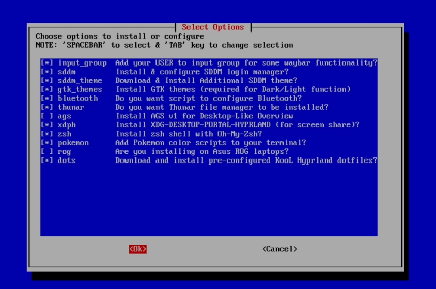

# HyprFlux

<div align="center">


[](https://opensource.org/licenses/MIT)
[](https://archlinux.org/)
[](https://hyprland.org/)
[](https://www.gnu.org/software/bash/)
[](https://github.com/ahmad9059/HyprFlux/stargazers)
[](https://github.com/ahmad9059/HyprFlux/network/members)

**A comprehensive collection of dotfiles and configurations for creating a beautiful, efficient Hyprland desktop environment on Arch Linux**

[🚀 Quick Install](#-quick-installation) • [📸 Screenshots](#-screenshots) • [🔧 Features](#-features) • <a href="https://hyprflux.dev/general/installation" target="_blank" rel="noopener noreferrer">📖 Documentation</a>
• [🤝 Contributing](#-contributing)

</div>

---

## 🌐 Website

**For detailed documentation and preferences, visit:** [https://hyprflux.dev](https://hyprflux.dev)

## 🌟 Overview

HyprFlux is a meticulously crafted collection of configuration files designed to transform your Arch Linux installation into a stunning, productive desktop environment. Built around the modern Hyprland compositor, it provides a seamless blend of aesthetics and functionality.

## 📸 Screenshots

<div align="center">

### Desktop Overview


|  |  |
| ------------------- | ------------------- |
|  |  |
|  |  |

</div>

### ✨ What Makes HyprFlux Special?

- **🎨 Beautiful Design**: Carefully curated themes and color schemes
- **⚡ Performance Optimized**: Lightweight and fast configurations
- **🔧 Fully Automated**: One-command installation with intelligent setup
- **🎯 Developer Focused**: Optimized for productivity and development workflows
- **🌈 Customizable**: Easy to modify and extend according to your preferences

## 📋 Requirements

### System Requirements

- **Operating System**: Arch Linux (minimal installation recommended)
- **Architecture**: x86_64
- **Memory**: Minimum 4GB RAM (8GB+ recommended)
- **Storage**: At least 10GB free space
- **Network**: Active internet connection for package downloads

### Prerequisites

- Fresh Arch Linux installation with minimal profile
- Basic system utilities (curl, git, sudo)
- User account with sudo privileges

## 🚀 Quick Installation

### One-Line Magic Command

```bash
sh <(curl -fsSL https://hyprflux.dev/install)
```

> **⚠️ Important**: This script will modify your system configuration. Make sure to backup any existing dotfiles before proceeding.

### Installation Process

1. **Run the installation command** - The script will automatically download and execute
2. **Enter sudo password** when prompted
3. **Follow the interactive setup** - Select your preferred options:



#### 🔧 Recommended Installation Options

**Essential Components** (Recommended):

- ✅ `sddm` - Display manager for login screen
- ✅ `sddm_theme` - Beautiful custom SDDM theme
- ✅ `gtk_themes` - GTK theme integration
- ✅ `bluetooth` - Bluetooth support
- ✅ `thunar` - File manager
- ✅ `xdph` - Desktop portal for Hyprland
- ✅ `zsh` - Enhanced shell with Oh My Zsh
- ✅ `dots` - Core dotfiles and configurations

**Optional Components**:

- `QuickShell` - QuickShell for Desktop-Like Overview
- `Pokemon` - Add Pokemon color scripts to your terminal
- `Rog` - Download and Install Pre-configured for ROG Laptops

#### 📝 Interactive Configuration

During installation, you'll be prompted to configure:

| Setting                 | Options              | Description                           |
| ----------------------- | -------------------- | ------------------------------------- |
| **Keyboard Layout**     | Various layouts      | Select your preferred keyboard layout |
| **Text Editor**         | nano, nvim, vim      | Choose your default terminal editor   |
| **Hyprlock Resolution** | Multiple resolutions | Set lock screen resolution            |
| **Clock Format**        | 12h / 24h            | Choose time display format            |
| **SDDM Wallpaper**      | Multiple options     | Select login screen background        |
| **Extra Wallpapers**    | Yes / No             | Download additional wallpapers (~1GB) |

#### 🔐 Authentication Notes

The installer will request sudo password **2-3 times** during the process:

- Once for initial system setup
- Once for Zsh configuration
- Once for wallust installation
- Additional prompts for optional packages

## 🎨 Features

### 🖥️ Desktop Environment

- **[Hyprland](https://hyprland.org/)**: Modern Wayland compositor with smooth animations
- **[Waybar](https://github.com/Alexays/Waybar)**: Highly customizable status bar
- **[Rofi](https://github.com/davatorium/rofi)**: Application launcher and window switcher
- **[SDDM](https://github.com/sddm/sddm)**: Beautiful login manager with custom theme

### 🎨 Theming & Aesthetics

- **[Material Design](https://material.io/design/)**: Deep Ocean color scheme
- **[Papirus Icons](https://github.com/PapirusDevelopmentTeam/papirus-icon-theme)**: Comprehensive icon theme with cyan accents
- **[Future Black Cursors](https://www.gnome-look.org/p/1713404/)**: Custom cursor theme
- **[GTK](https://www.gtk.org/)** Integration: Seamless theme integration across applications

### 🛠️ Development Tools

- **[Neovim](https://neovim.io/)**: Fully configured with plugins and LSP support
- **[Tmux](https://github.com/tmux/tmux)**: Terminal multiplexer with custom layouts
- **[Zsh](https://www.zsh.org/)**: Enhanced shell with Oh My Zsh and custom theme
- **[Git](https://git-scm.com/)** Integration: Pre-configured Git settings

### 📱 Applications & Utilities

- **[Thunar](https://docs.xfce.org/xfce/thunar/start)**: File manager with custom configurations
- **[Foot](https://codeberg.org/dnkl/foot)**, **[Alacritty](https://alacritty.org/)**, **[Kitty](https://sw.kovidgoyal.net/kitty/)**: Terminal options
- **[VLC](https://www.videolan.org/vlc/)**, **[OBS Studio](https://obsproject.com/)**: Media and content creation tools
- **[Obsidian](https://obsidian.md/)**, **[VS Code](https://code.visualstudio.com/)**: Productivity applications

### 🌐 Web Applications

Automated setup of Progressive Web Apps (PWAs) for:

- [Netflix](https://www.netflix.com/), [YouTube](https://www.youtube.com/), [Spotify](https://open.spotify.com/)
- [GitHub](https://github.com/), [Vercel](https://vercel.com/), [Figma](https://www.figma.com/)
- [ChatGPT](https://chat.openai.com/), [Claude](https://claude.ai/), [Grok](https://x.ai/)
- [WhatsApp](https://www.whatsapp.com/), [Discord](https://discord.com/), [Slack](https://slack.com/)
- And many more...

## 🔧 Post-Installation

### First Boot

After installation completes:

1. **Reboot your system** when prompted
2. **Login through SDDM** with your user credentials
3. **Enjoy your new desktop environment!**

### Customization

- **Wallpapers**: Located in `~/Pictures/wallpapers/`
- **Configurations**: Found in `~/.config/`
- **Themes**: Available in `~/.themes/`
- **Backup**: Original configs backed up to `~/dotfiles_backup/`

## 📖 Documentation

### 🗂️ Project Structure

```
HyprFlux/
├── .config/                 # Application configurations
│   ├── hypr/               # Hyprland configuration
│   ├── waybar/             # Status bar configuration
│   ├── rofi/               # Application launcher
│   └── ...
├── .themes/                # GTK themes
├── wallpapers/             # Wallpaper collection
├── utilities/              # Additional tools and themes
├── install.sh              # Main installation script
├── dotsSetup.sh           # Dotfiles setup script
└── README.md              # This file
```

### 🔧 Key Configuration Files

- `~/.config/hypr/hyprland.conf` - Hyprland window manager settings
- `~/.config/waybar/config` - Status bar configuration
- `~/.config/rofi/config.rasi` - Application launcher styling
- `~/.zshrc` - Zsh shell configuration
- `~/.tmux.conf` - Terminal multiplexer settings

### Getting Help

- 📋 Check the [Issues](https://github.com/ahmad9059/HyprFlux/issues) page
- 💬 Join our community discussions
- 📧 Contact: [ahmad9059@example.com](mailto:ahmad9059@example.com)

## 🤝 Contributing

We welcome contributions! Here's how you can help:

### 🐛 Reporting Bugs

1. Check existing [issues](https://github.com/ahmad9059/HyprFlux/issues)
2. Create a new issue with detailed information
3. Include system information and error logs

### 💡 Suggesting Features

1. Open a feature request issue
2. Describe the feature and its benefits
3. Provide implementation ideas if possible

### 🔧 Code Contributions

1. Fork the repository
2. Create a feature branch: `git checkout -b feature-name`
3. Make your changes and test thoroughly
4. Submit a pull request with detailed description

### 📝 Documentation

- Improve README and documentation
- Add configuration examples
- Create tutorials and guides

## 📄 License

This project is licensed under the MIT License - see the [LICENSE](LICENSE) file for details.

## 🙏 Acknowledgments

Special thanks to:

- **Hyprland Community** - For the amazing compositor
- **Arch Linux Team** - For the robust foundation
- **Open Source Contributors** - For the tools and themes used
- **Community Members** - For feedback and contributions

## 📊 Project Stats


---

<div align="center">

**Made with ❤️ by [ahmad9059](https://github.com/ahmad9059)**

⭐ **Star this repository if you found it helpful!** ⭐

</div>
